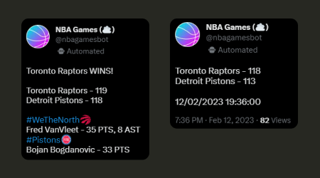

<div align="center">
    
</div>

[](https://twitter.com/nbagamesbot)
                    
## 📚 Sobre 

O projeto **NBA Scorebot** foi desenvolvido com intuito de tweetar os placares de jogos da NBA em tempo real, e também tem uma funcionalidade que mostra os resultados da partida logo quando finalizada. Futuramente contará com mais funcionalidades que não se limitaram apenas a partidas, também a estatítica dos jogadores, partidas e recordes históricos.
                    
Os formatos de tweets para alertar placar e resultado das partidas:
                    
<h1 align="center">
    
</h1>

## 🚀 Tecnologias utilizadas

- NodeJS
- Twitter API v2

## ⏱ Iniciar projeto 

```bash
# Clonar o repositório
$ git clone https://github.com/hiagomu/nba-scorebot.git

# Instalar as dependências
$ npm install

# Iniciar o servidor
$ npm start

```
---
Desenvolvido por Hiago Murilo
