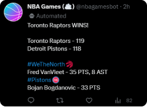
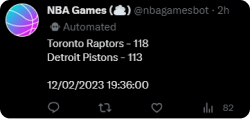

<div align="center">
    
</div>
                    
## 📚 Sobre 

O projeto **NBA Scorebot** foi desenvolvido com intuito de tweetar os placares de jogos da NBA em tempo real, e também tem uma funcionalidade que mostra os resultados da partida logo quando finalizada. Futuramente contará com mais funcionalidades que não se limitaram apenas a partidas, também a estatítica dos jogadores e recordes históricos.
                    
Os formatos de tweets para alertar placar e resultado das partidas:
                    
<div align="center">
    
    
</div>

## 🚀 Tecnologias utilizadas

- NodeJS
- Twitter API v2

## 📋 Pré-requisitos

- **Node.js**: Você precisa do Node.js instalado para rodar o bot. Você pode baixar [aqui](https://nodejs.org/en/download).

- **Twitter**: Você precisa ter uma conta no twitter. Você pode criar uma [aqui](https://twitter.com/i/flow/signup).

- **Twitter developer**: Faça login na sua conta e aplique para obter uma conta de desenvolvedor. Você pode aplicar [aqui](https://developer.twitter.com/en/apply-for-access).

## ⏱ Iniciar projeto 

```bash
# Clonar o repositório
$ git clone https://github.com/hiagomu/nba-scorebot.git

# Instalar as dependências
$ npm install

# Iniciar o servidor
$ npm start

```
---
Desenvolvido por Hiago Murilo [](https://twitter.com/nbagamesbot)
